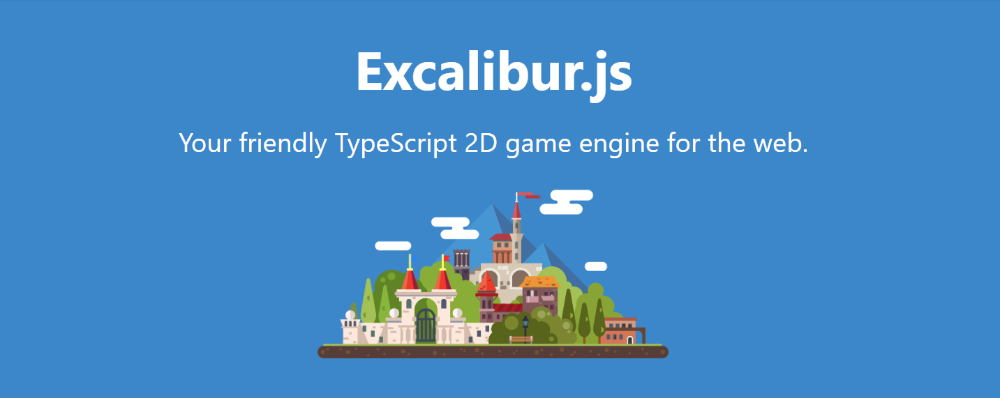
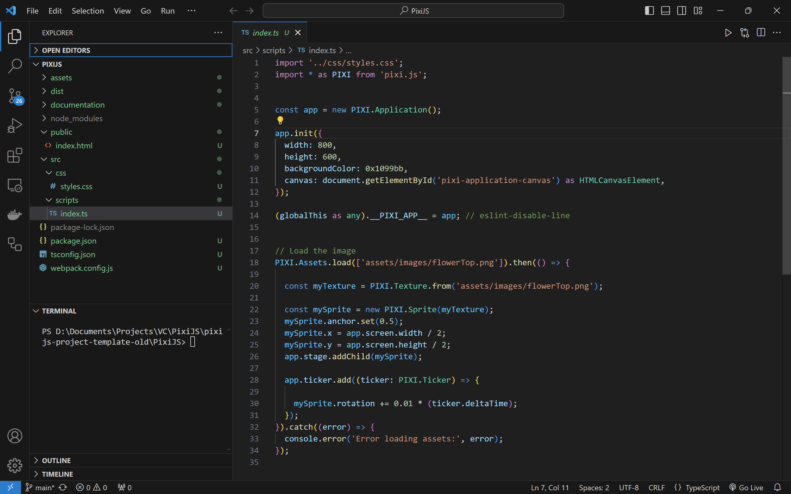

# ExcaliburJS Mini Arcade

This repo is ideal for new [ExcaliburJS](https://excaliburjs.com/) projects using [TypeScript](https://www.typescriptlang.org/) and [Vite](https://vitejs.dev/).

<figure>

<figcaption>Image 1 - ExcaliburJS Game Engine - HTML5 + WebGL</figcaption>
</figure>

### Table of Contents

1. [Getting Started](#getting-started)
2. [Project Overview](#project-overview)
3. [Project Details](#project-details)
4. [Resources](#resources)
5. [Credits](#credits)

 

# Getting Started

### Play Project

1. Browse to game [https://SamuelAsherRivello.github.io/Excaliburjs-mini-arcade](https://samuelasherrivello.github.io/excaliburjs-mini-arcade/index.html) ( _Temporarily Broken_ )

1. Browse to docs [https://SamuelAsherRivello.github.io/Excaliburjs-mini-arcade/documentation](https://samuelasherrivello.github.io/excaliburjs-mini-arcade/documentation/index.html)

1. Enjoy!

### Build Project

1. Download this repo (_.zip or _.git)
2. Open the `ExcaliburJS` folder in the command line:
3. Install dependencies:
   - Run `npm install` to download and install dependencies.
4. Build the project:
   - Run `npm run client-build` to build the project.
5. Run the project:
   - Run `npm run client-start-watch` to launch a server to localhost. This serves the development build and hot-reloads on changes within the **src**.
6. Play the game at [localhost:3000](http://localhost:3000)
7. Open the `ExcaliburJS` folder in [Visual Studio Code](https://code.visualstudio.com/) or your favorite editor
8. Do your game development
9. Optional: When you add/update files within the `ExcaliburJS` folder, you may need to repeat step 4.
10. Optional: [Host](https://pages.github.com/) your project online and share the link with friends!
11. Enjoy!

 

### More Commands

You can run these terminal commands during your workflows.

| Command                      | Description                                 | Builds? | Runs? | Tests? | Watches? |
| ---------------------------- | ------------------------------------------- | ------- | ----- | ------ | -------- |
| `npm install`                | Required: Download and install dependencies | ❌      | ❌    | ❌     | ❌       |
| `npm run client-build`       | Required: Build app                         | ✅      | ❌    | ❌     | ❌       |
| `npm run client-start-watch` | Required: Run app on localhost              | ❌      | ✅    | ❌     | ✅       |
| `npm run tests-start-watch`  | Optional: Run unit tests in watch mode      | ❌      | ❌    | ✅     | ✅       |

 

# Project Overview

This repo demonstrates best practices for combining HTML5 technologies for game development in the browser using ExcaliburJS.
Use cases for this repo include light-weight prototypes, educational projects, and browser-based game development.

<figure>

<figcaption>Image 2 - Editor Environment (File Explorer, Terminal, Code Editor)</figcaption>
</figure>

**Documentation**

- `ReadMe.md` - The primary documentation for this repo
- `ExcaliburJS/documentation/` - More info specific to the project

**Configuration**

- `Game Engine` - [ExcaliburJS](https://excaliburjs.com/) is a 2D game engine for TypeScript

**Structure**

- `ExcaliburJS` - Main project folder
- `ExcaliburJS/index.html` - Main HTML5 file
- `ExcaliburJS/src/assets/` - User-facing game assets
- `ExcaliburJS/src/scripts/tests/` - Add unit testing files here
- `ExcaliburJS/src/scripts/client/index.ts` - Main TS file for game logic. Do your work here :)

**Dependencies**

- `./ExcaliburJS/package.json` - Lists project dependencies and scripts. When you run `npm install` it installs whatever is here

# Project Details

**Editor Tooling**

These may be installed manually by you.

| Name                                                                                                                   | Description                                              | Runtime? | Edit Time? |
| ---------------------------------------------------------------------------------------------------------------------- | -------------------------------------------------------- | -------- | ---------- |
| [Google Chrome](https://www.google.com/chrome/)                                                                        | Chrome Browser                                           | ✅       | ❌         |
| [ExcaliburJS Dev Tools](https://chromewebstore.google.com/detail/excalibur-dev-tools/dinddaeielhddflijbbcmpefamfffekc) | Chrome Browser Extension: Debug ExcaliburJS              | ✅       | ❌         |
| [Visual Studio Code](https://code.visualstudio.com/)                                                                   | VS Code Editor                                           | ❌       | ✅         |
| [ESLint extension](https://marketplace.visualstudio.com/items?itemName=dbaeumer.vscode-eslint)                         | VS Code Editor Extension: Linting JavaScript/TS          | ❌       | ✅         |
| [Error Lens extension](https://marketplace.visualstudio.com/items?itemName=usernamehw.errorlens)                       | VS Code Editor Extension: Highlights errors and warnings | ❌       | ✅         |

**Code Packages (Partial List)**

These will be installed automatically for you.

| Name                                                   | Description                  | Runtime? | Edit Time? |
| ------------------------------------------------------ | ---------------------------- | -------- | ---------- |
| [excalibur](https://www.npmjs.com/package/excalibur)   | ExcaliburJS: 2D game engine  | ✅       | ❌         |
| [vite](https://vitejs.dev/)                            | Bundles TypeScript files     | ❌       | ✅         |
| [typescript](https://www.npmjs.com/package/typescript) | TypeScript compiler          | ❌       | ✅         |
| [eslint](https://www.npmjs.com/package/eslint)         | Makes your TypeScript pretty | ❌       | ✅         |
| [vitest ](https://vitest.dev/)                         | Unit testing for TypeScript  | ❌       | ✅         |

# Resources

Here are some resources which may be helpful with HTML5 game projects using ExcaliburJS:

- [ExcaliburJS Documentation](https://excaliburjs.com/docs/)
- [ExcaliburJS API Reference](https://excaliburjs.com/docs/api/)
- [ExcaliburJS Samples](https://excaliburjs.com/samples/)

 

# Credits

**Created By**

- Samuel Asher Rivello
- Over 25 years XP with game development (2024)
- Over 11 years XP with Unity (2024)

**Contact**

- Twitter - <a href="https://twitter.com/srivello/">@srivello</a>
- Git - <a href="https://github.com/SamuelAsherRivello/">Github.com/SamuelAsherRivello</a>
- Resume & Portfolio - <a href="http://www.SamuelAsherRivello.com">SamuelAsherRivello.com</a>
- LinkedIn - <a href="https://Linkedin.com/in/SamuelAsherRivello">Linkedin.com/in/SamuelAsherRivello</a> <--- Say Hello! :)

**License**

Provided as-is under MIT License | Copyright © 2024 Rivello Multimedia Consulting, LLC
